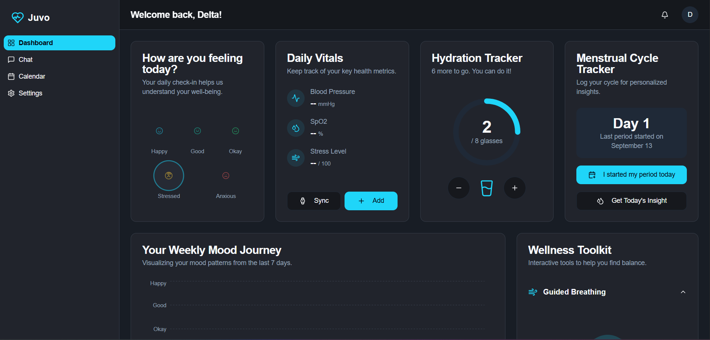

# Juvo - Your AI Mental Wellness Companion

Juvo is a comprehensive web application designed to be a personal AI companion for mental and physical wellness. It offers a suite of tools to help users track their health, understand their emotional patterns, and receive supportive, AI-driven feedback.

 <!-- Replace with an actual screenshot URL -->

## ✨ Features

-   **User Authentication**: Secure sign-up and login functionality.
-   **Personalized Dashboard**: A central hub displaying key wellness metrics at a glance.
-   **Mood Tracking**: Daily mood logging with a 7-day visualization chart to track emotional trends.
-   **AI Chatbot Therapist**: A compassionate chatbot named Juvo, capable of understanding text and voice input, detecting mood from vocal tone, and providing therapeutic conversation.
-   **Crisis Support**: In high-distress situations, the app provides immediate options to call a helpline (Tele-MANAS) or a pre-configured friend.
-   **Caretaker Alerts**: Automatically sends an email alert to a designated caretaker when a high level of sadness is detected in the chat.
-   **Health Vitals Tracking**: Manually log and monitor Blood Pressure, SpO2, and Stress Levels.
-   **Hydration Tracker**: A simple interface to track daily water intake against a personalized goal.
-   **Menstrual Cycle Tracker**: For female users, this feature allows logging menstrual cycles to receive tailored AI insights connecting their cycle phase to their mood.
-   **Food & Mood Diary**: Log daily meals and receive AI-powered analysis on how food choices might be influencing mood, taking BMI and menstrual cycle into account.
-   **Circadian Health Insights**: Analyze the connection between sleep patterns and recent moods with AI-generated feedback.
-   **Wellness Toolkit**:
    -   **Guided Breathing**: A visual animation to guide users through a simple, calming breathing exercise.
    -   **AI Affirmation Generator**: Generate positive affirmations based on the user's current mood and needs.
-   **Comprehensive Settings**:
    -   Update profile information, including height, weight, and profile picture.
    -   Set and manage sleep schedules for personalized insights.
    -   Configure caretaker and friend contact details.

## 🛠️ Technology Stack

-   **Framework**: [Next.js](https://nextjs.org/) (with App Router)
-   **Styling**: [Tailwind CSS](https://tailwindcss.com/) & [ShadCN UI](https://ui.shadcn.com/)
-   **AI & Generative Features**: [Google AI & Genkit](https://firebase.google.com/docs/genkit)
-   **Backend & Database**: [Firebase](https://firebase.google.com/) (Authentication, Firestore, Storage)
-   **Email Service**: [n8n](https://n8n.io/) (for webhook-based email alerts)
-   **Deployment**: Configured for Firebase App Hosting, but can be deployed on services like Vercel or Render.

## 🚀 Getting Started

### Prerequisites

-   Node.js (v18 or later)
-   npm or yarn
-   A Firebase project
-   An n8n instance with a webhook configured for sending emails.

### 1. Clone the Repository

```bash
git clone https://github.com/Rayan-Ghosh/Juvo.git
cd Juvo
```

### 2. Install Dependencies

```bash
npm install
```

### 3. Configure Environment Variables

Create a `.env` file in the root of the project and add your Firebase project configuration and n8n webhook URL:

```
# Firebase Configuration
NEXT_PUBLIC_FIREBASE_PROJECT_ID="your-firebase-project-id"
NEXT_PUBLIC_FIREBASE_APP_ID="your-firebase-app-id"
NEXT_PUBLIC_FIREBASE_STORAGE_BUCKET="your-firebase-storage-bucket"
NEXT_PUBLIC_FIREBASE_API_KEY="your-firebase-api-key"
NEXT_PUBLIC_FIREBASE_AUTH_DOMAIN="your-firebase-auth-domain"
NEXT_PUBLIC_FIREBASE_MESSAGING_SENDER_ID="your-firebase-messaging-sender-id"

# n8n Webhook for Email Alerts
N8N_WEBHOOK_URL="your-n8n-webhook-url-here"

# Gemini API Key for Genkit
GEMINI_API_KEY="your-google-ai-api-key"
```

You can find your Firebase configuration in your Firebase project settings under "Your apps".

### 4. Run the Development Server

To run the Next.js application locally:

```bash
npm run dev
```

To run the Genkit AI flows (in a separate terminal):

```bash
npm run genkit:watch
```

